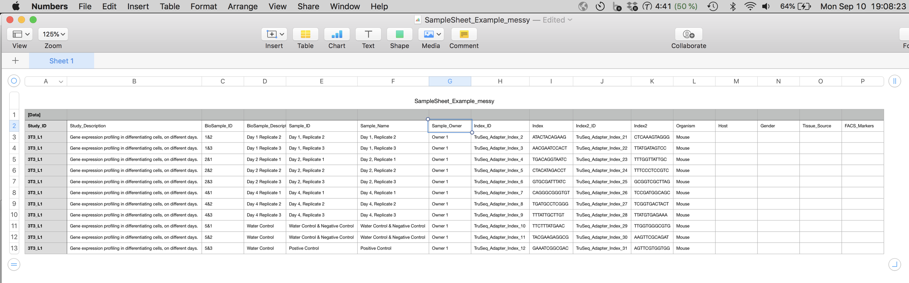

Challenge questions for Project Organization
================

## Challenge 1

With the person next to you, discuss:

What kinds of data and information have you generated before you send
your DNA/RNA off for sequencing?

## Challenge 1 answers

Types of files and information you have generated:

  - spreadsheet or tabular data with the data from your experiment and
    whatever you were measuring for your study  
  - lab notebook notes about how you conducted those experiments
    spreadsheet or tabular data about the samples you sent off for
    sequencing. Sequencing centers often have a particular format they
    need with the name of the sample, DNA concentration and other
    information.  
  - lab notebook notes about how you prepared the DNA/RNA for sequencing
    and what type of sequencing you’re doing, e.g. paired end Illumina
    HiSeq.

*There likely will be other ideas here too. Was this more information
and data than you were expecting?*

## Challenge 2

This is some potential spreadsheet data for an experiment being
submitted for sequencing. The program bcl2fastq requires this
spreadsheet to use as input to demultiplex the sequencing data into
separate files, one per sample. With the person next to you, for about 2
minutes, discuss some of the problems with the spreadsheet data shown
here.

